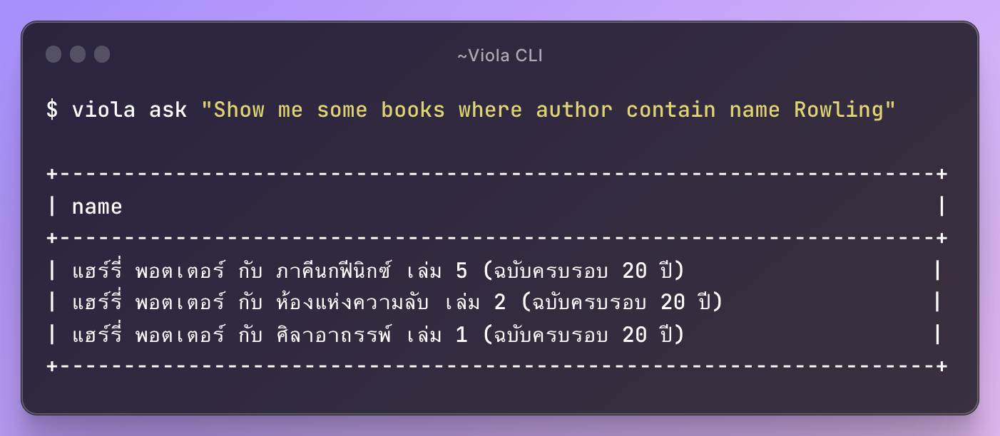

# Viola PHP

[](https://packagist.org/packages/farzai/viola-php)
[](https://github.com/farzai/viola-php/actions/workflows/run-tests.yml)
[](https://packagist.org/packages/farzai/viola-php)


Viola is a PHP package that allows you to ask questions to ChatGPT and get the answer with your own data.



## Requirements

- PHP >= 8.0
- OpenAI Key

## Installation

You can install the package globally via composer:

```bash
$ composer global require farzai/viola
```
Make sure to place Composer's system-wide vendor bin directory in your $PATH so the viola executable can be located by your system. 
This directory exists in different locations based on your operating system;
however, some common locations include:


For macOS
```
$HOME/.composer/vendor/bin
```

For GNU / Linux Distributions
```
GNU / Linux Distributions: $HOME/.config/composer/vendor/bin
```

For Windows
```
%USERPROFILE%\AppData\Roaming\Composer\vendor\bin
```

## Usage

First, you need to set your OpenAI key and Database Connection.
```bash
$ viola config

# API Key: <your-openai-key>
# Database Connection name: <your-connection-name>
# Choose database driver: <mysql|pgsql|sqlsrv>
# Enter database host, port, database name, username, password
```

Then, you can try to ask a question to ChatGPT.
```bash
$ viola ask "Show me all books by J. K. Rowling."
```

```bash
Here, I found 2 books by J. K. Rowling:

|----|------------------------------------------|---------------|------|
| id | title                                    | author        | year |
|----|------------------------------------------|---------------|------|
| 1  | Harry Potter and the Philosopher's Stone | J. K. Rowling | 1997 |
| 2  | Harry Potter and the Chamber of Secrets  | J. K. Rowling | 1998 |
|----|------------------------------------------|---------------|------|
```


## Commands

```bash
# Ask a question to ChatGPT.
$ viola ask "<your-question>"
```

```bash
# Set your OpenAI key and Database Connection.
$ viola config
```

```bash
# Show all database connections.
$ viola config:show
```

```bash
# Change current connection
$ viola use <connection-name>
```

```bash
# Clear all database connections.
$ viola config:clear all

# Or clear a specific connection.
$ viola config:clear <connection-name>
```

---

## For Developers

### Installation

1. Install in your project via composer.
2. Use `Farzai\Viola\Viola` class to create a new instance.

```php
use Farzai\Viola\Viola;

// Setup Viola.
$viola = Viola::builder()
    ->setApiKey(string $key)
    ->setDatabaseConfig(string $driver, array $databaseConfig)
    ->setClient(\Psr\Http\Client\ClientInterface $client)
    ->setLogger(\Psr\Log\LoggerInterface $logger)
    ->build();

// Ask a question to ChatGPT.
$answer = $viola->ask('Show me all books by J. K. Rowling.');

// Get the answer.
echo $answer->getAnswer();

// Or get the answer with the results.
foreach ($answer->getResults() as $row) {
    //
}
```


## Testing

```bash
$ composer test
```

## Changelog

Please see [CHANGELOG](CHANGELOG.md) for more information on what has changed recently.

## Contributing

Please see [CONTRIBUTING](https://github.com/spatie/.github/blob/main/CONTRIBUTING.md) for details.

## Security Vulnerabilities

Please review [our security policy](../../security/policy) on how to report security vulnerabilities.

## Credits

- [parsilver](https://github.com/parsilver)
- [All Contributors](../../contributors)

## License

The MIT License (MIT). Please see [License File](LICENSE.md) for more information.
